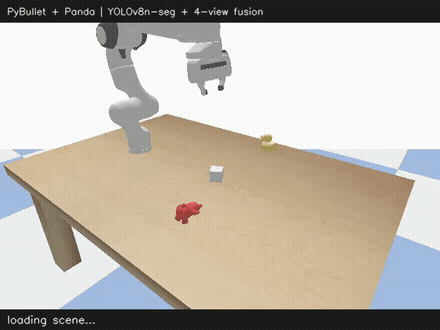

# Grasp Simulation Pipeline


PyBullet + Franka Panda 机械臂视觉引导抓取。使用 YOLOv8n-seg 进行 mask 提取，4 视角迭代融合定位，按"夹持面覆盖物体"物理规则推导抓取高度。



*演示：4 视角融合定位 → IK 接近/精细下降 → 夹爪闭合 → 轻提验证（3/3）。用 `scripts/record_demo.py` 无 GUI 程序化录制（DIRECT + 软件渲染 + 每 8 仿真步抓帧），可重复生成。*

## 实测结果（PyBullet 仿真 / 3 类物体 / CPU）

| 指标 | 结果 | 复现命令 |
|---|---|---|
| 抓取成功率（固定配置 n=10） | **30/30 (100%)** | `--grasp-trials 10` |
| 抓取成功率（±2cm 位置抖动 n=10） | **29/30 (97%)** | `--grasp-trials 10 --jitter 0.02` |
| 抓取成功率（+45° 整体旋转 n=2） | **6/6 (100%)** | `--grasp-trials 2 --rot 45` |
| 定位精度 XY（duck/teddy/cube） | **0.75 / 1.37 / 0.92 cm** | `--pose-trials 5` |
| 定位精度 Z（vs GT AABB 中点） | **+0.12 / +0.73 / +0.82 cm** | 同上 |
| 逐视角 Z 一致性 | **0.3–0.4 cm** | `scripts/diagnose_z_bias.py` |
| 分割模型（自建 200 图仿真集） | box mAP50 **0.995** / mask mAP50-95 **0.881** | `scripts/train_yolo_custom.py` |

> 口径：成功判据 = 轻提后物体 Δz > 1cm；以上均为**仿真内**结果，**无真机验证**。
> 定位精度以 GT **AABB 中点**为参照（点云质心是"可见表面"质心，与 URDF 基座原点天然差半个物体高度）。
>
> 许可说明：本仓库代码为 MIT；`models/custom_yolov8n_seg.pt` 由 ultralytics **YOLOv8n-seg**（AGPL-3.0）在自建仿真集上微调而来，
> 沿用其许可证；如需宽松许可，用 `scripts/train_yolo_custom.py` 重新训练或替换为其他模型即可。

## 测试与 CI

```bash
python -m pytest -q      # 10 个回归测试，约 15s，无 GUI（DIRECT 渲染）
```

`tests/test_regression.py` 把历史上 4 类"能跑通但系统性错误"的缺陷固化成护栏：相机内参模型（垂直 FOV / 焦距尺度）、
反投影 y 轴符号、IK 目标坐标系（link frame vs 质心 CoM）、末端指尖几何；另含 rayTest 物理真值对照与端到端定位冒烟测试。
CI（`.github/workflows/ci.yml`）在 Ubuntu + Python 3.12 上跑同一套测试。

## 架构

```
Stage1: 默认相机 → YOLO → 点云 → 粗略 XY
  │
  ▼ (指向 rough XY)
Stage2: 4 视角 → YOLO → 逐视角 3D 质心 → LOO+mask-size 加权中位数
  → 最多 5 次迭代 + 发散检测
  │
  ▼
Grasp: table_z + waist_ratio × (z_max − table_z)  (per-object ratio)
        hardcoded per-object yaw (PCA 已证明不可行)
        safety clamp: fingertip_z ≥ TABLE_SURFACE_Z + 5mm
```

### 关键设计决策

**抓取高度** — 按"夹持面覆盖物体"的物理规则推导（实测夹持面 0.062m）：物体比夹持面矮 → 指尖贴桌（`table_z+5mm`）使夹持面覆盖整个物体；物体更高 → 夹持面在物体上居中覆盖 `table_z + (h−0.062)/2`。`grasp_z` 即真实指尖目标，`fine_z = grasp_z + FINGER_OFFSET`。

**内参** — PyBullet `computeProjectionMatrixFOV` 的 fov 是**垂直** FOV：`f = (H/2)/tan(fov/2) = 415.7px`，主点 `(320, 240)`，且图像行 v 需取负号（`y_cam = −(v−cy)·z/f`）。旧代码用 `(W/2)` 使焦距偏大 4/3 倍并靠 `cy_offset` 凑合，是 Z 长期偏高 8~12cm 的根因。

**抓取偏航** — 物体类别硬编码。PCA 在单视角（透视畸变制造虚假长轴）和多视角（点云圆形化）均有根本性缺陷。

| 物体 | 抓取高度（规则推导） | yaw | IK force | fine_steps |
|------|-------------|-----|----------|------------|
| teddy | 0.630m（夹持面居中） | 90° (躺桌上，沿 X 夹窄处) | 800N | 600 |
| duck | 0.634m（夹持面居中） | 0° | 500N | 600 |
| cube | 0.630m（贴桌覆盖全身） | 0° | 1000N | 800 |

## 文件结构

```
src/
├── configs/config.py        # 所有参数配置（含 MULTI_OBJECTS_CONFIG）
├── control/ik_controller.py # 自适应 IK 位置控制
├── env/sim_env.py           # 仿真环境 (含 setup_simulation_multi)
├── perception/
│   ├── camera.py            # PyBullet 相机渲染 (RGB/深度/分割)
│   ├── detector.py          # 目标检测 (FakeDetector / YOLO)
│   └── pose_estimator.py    # 点云反投影、多视角融合、相机标定
└── pipeline/                # 管道封装
scripts/
├── test_multi_object_grasp.py   # ⭐ 主抓取流程（多物体 YOLO 版）
├── test_grab_and_see.py         # 单物体 seg_img 版
├── test_multi_object.py         # 多物体环境加载验证
├── test_multi_object_detection.py # 多物体检测 + 位姿估计
├── generate_yolo_dataset.py     # YOLO 训练数据生成
├── train_yolo_custom.py         # 自定义 YOLO 训练
├── batch_test_final.py          # 批量统计：定位精度 + 抓取成功率（复用主线函数）
├── diagnose_duck_grasp.py       # 鸭子诊断
├── diagnose_centroid.py         # 单视角诊断
├── test_pose_estimation.py      # 位姿估计验证
├── test_move.py                 # 基础运动测试
├── diagnose_z_bias.py           # Z 偏高根因诊断（内参/深度轴/融合口径）
├── diagnose_finger_geometry.py  # 末端真实几何实测（CoM vs link frame、指尖、夹持面）
├── diagnose_yaw.py              # 偏航可观测性诊断
├── sweep_grasp_height.py        # 抓取高度扫描（标定用）
└── record_demo.py               # 无 GUI 程序化录制演示 → docs/demo.gif|mp4
tests/                           # pytest 回归护栏（无 GUI，10 个测试）
.github/workflows/ci.yml         # CI：Ubuntu + Python 3.12
models/
├── custom_yolov8n_seg.pt        # 训练好的 YOLO 模型
└── yolo_duck_teddy_cube/        # 训练日志
yolo_dataset/                    # 训练数据集（200 图，标签与图像成对入库）
docs/                            # 文档与演示媒体（demo.gif / demo.mp4）
LICENSE                          # MIT
```

## 使用

```bash
uv run python scripts/test_multi_object_grasp.py    # ⭐ 多物体 YOLO 抓取（主线）
uv run python scripts/test_grab_and_see.py           # 单物体 seg_img 版
uv run python scripts/test_multi_object.py           # 多物体环境加载验证
uv run python scripts/test_multi_object_detection.py # 多物体检测 + 位姿估计
uv run python scripts/generate_yolo_dataset.py       # YOLO 训练数据生成
uv run python scripts/train_yolo_custom.py           # YOLO 训练
uv run python scripts/batch_test_final.py --pose-trials 5 --grasp-trials 3   # 批量统计（定位精度 + 抓取成功率）
```

## 关键参数

| 参数 | 值 | 说明 |
|------|------|------|
| 虚拟相机 | 640×480, FOV=60°, near=0.1m, far=3.0m | PyBullet 内置 |
| TABLE_SURFACE_Z | 0.625m | 桌面高度（独立于 ROBOT_BASE_POS） |
| ROBOT_BASE_POS | [0, 0, 0.50] | 机械臂基座（降低以扩展工作空间） |
| FINGER_OFFSET | 0.1162m | IK 控制的 hand link frame → 真实指尖（实测；旧值 0.105 读到的是 CoM 高度） |
| 融合视角 | 右侧/正前/左侧/左后 4 视角 | `cy_offset=0`（真主点 240，内参已修正） |

## 自定义 YOLO 模型

- **模型**: YOLOv8n-seg, 3.26M 参数, 11.3 GFLOPs
- **训练指标**: Box/ Mask mAP50 = 0.995, mAP50-95 = 0.917
- **推理速度**: ~43ms/张 (CPU Intel i7-14650HX)
- **训练数据**: 200 张 PyBullet 仿真标注图 (150 train + 50 val)

## 待探索 / 已评估

**6D 姿态（偏航）—— 已评估，暂不投入**（完整数据见 `log.md` STEP13）

- 修完内参后，融合点云 PCA **仍给不出可用偏航**：与 GT 误差中位 teddy **15.7°**、duck **70.2°**、cube **不可观测**（正方形足迹 → 2D 协方差退化，旋转 135° 期间 PCA 角恒定 144±5°）。机制是 4 视角表面点并集后 XY 足迹各向异性太弱（伸长比 1.15–1.5）且含视角固定的伪信号。
- 但实测**偏航容差很宽**（用现有硬编码偏航）：相对错位 **+45° → 6/6 零代价**；+90° → duck/teddy 仍 2/2，仅 cube 0/2（n=2，每次 1 个接触点、穿透 −0.002，无法与 cube 固有的临界夹持分离）。
- **重估触发条件**：出现细长/扁平物体（偏航直接决定能否夹住）、需要定向放置/插入（非 pick-and-lift）、或换真机（无 GT oracle）。届时路径：仿真惯性张量 oracle（`getDynamicsInfo` 主轴，仅仿真有效，作上界/标签）→ 学习式 6D 位姿（需 GPU；本机 torch CPU-only，暂不现实）。
- 诊断/测试工具已就绪：`scripts/diagnose_yaw.py`（偏航可观测性）、`batch_test_final.py --rot N`（偏航敏感性）。

**其它**

- YOLO 再训练覆盖边缘物体/大偏转角度
- cube 临界夹持是当前**唯一**观察到的失败模式（与偏航无关）：先补 n≥10 归因，再调夹持高度/力度

